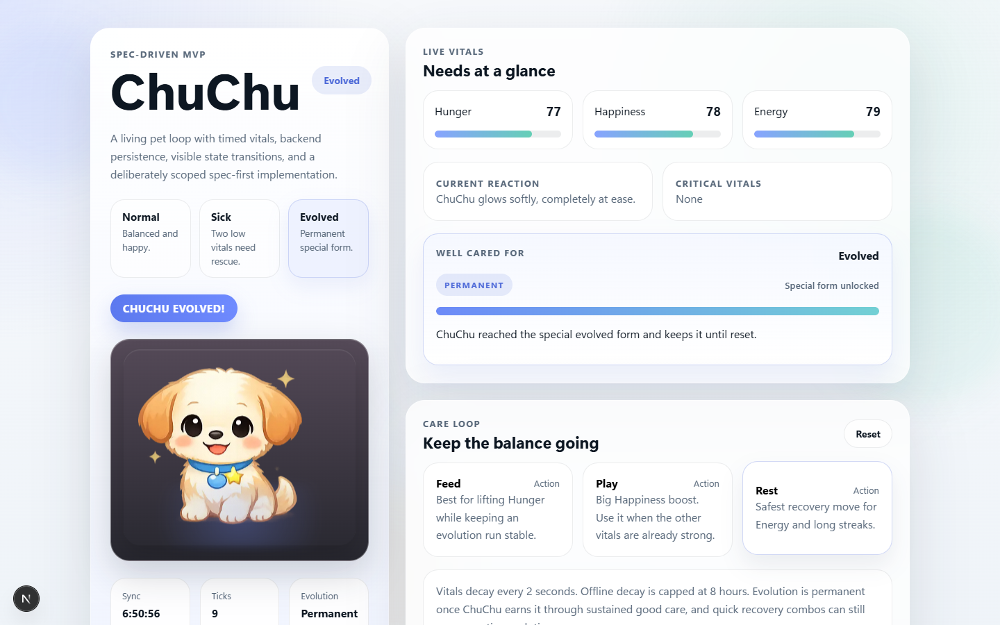
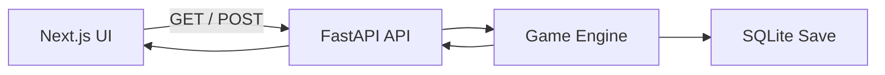

# Tiny Tamagotchi MVP

ChuChu is a standalone, spec-driven virtual pet built for the DeepLearning.AI Tiny Tamagotchi MVP challenge.

[](https://github.com/usermanoj/Tamagotchi-SDD-Codex/actions/workflows/ci.yml)
[](./web)
[](./api)
[](./api)
[](./specs)
[](https://render.com/deploy?repo=https://github.com/usermanoj/Tamagotchi-SDD-Codex)
[](https://usermanoj.github.io/Tamagotchi-SDD-Codex/)

## Preview

<p align="center">
  <a href="https://usermanoj.github.io/Tamagotchi-SDD-Codex/">
    
  </a>
</p>

## Watch The Playthrough

<p align="center">
  <a href="https://usermanoj.github.io/Tamagotchi-SDD-Codex/">
    
  </a>
</p>

The recorded demo is now intended to play from GitHub Pages, which is the same lightweight approach used in the Antigravity submission.

## Why This Repo

- Spec-first workflow with a clear constitution, feature plans, requirements, and validation docs
- Playable virtual pet loop with `Normal`, `Sick`, and permanent `Evolved` states
- Backend-persisted pet lifecycle instead of browser-only state
- Clean standalone architecture: `Next.js` frontend + `FastAPI` backend

## Live Demo

A public deployment can be launched from this repository using the included [Render blueprint](./render.yaml).

- One-click deploy: [Deploy to Render](https://render.com/deploy?repo=https://github.com/usermanoj/Tamagotchi-SDD-Codex)
- Playthrough page: [Open the GitHub Pages demo player](https://usermanoj.github.io/Tamagotchi-SDD-Codex/)
- Direct video: [Open the hosted WebM demo](https://usermanoj.github.io/Tamagotchi-SDD-Codex/chuchu-demo.webm)

Note:
The Render blueprint is committed and ready. The actual public app URL appears after the first deployment is created in Render. GitHub Pages may take a minute or two to publish after a push.

## Core Experience

- Living vitals: Hunger, Happiness, and Energy decay automatically over time
- Care actions: Feed, Play, and Rest update the pet immediately with clear trade-offs
- State transitions: ChuChu responds visually and behaviorally to good care or neglect
- Evolution path: sustained high vitals unlock a permanent evolved form
- Persistence: the pet state survives refreshes through the backend data layer

## System Overview



## Spec Suite

### Constitution

- [Mission](./specs/mission.md)
- [Roadmap](./specs/roadmap.md)
- [Tech Stack](./specs/tech-stack.md)

### Feature Specs

- [Core Simulation Loop](./core-simulation-loop/requirements.md)
- [Care Actions And Feedback](./care-actions-feedback/requirements.md)
- [State Progression And Personality](./state-progression-personality/requirements.md)
- [Persistence And Presentation Shell](./persistence-shell/requirements.md)

### Validation

- [Validation Report](./docs/validation-report.md)
- [Backend tests](./api/tests/test_game_engine.py)

## Project Structure

```text
tiny-tamagotchi-mvp/
  specs/
  core-simulation-loop/
  care-actions-feedback/
  state-progression-personality/
  persistence-shell/
  api/
  web/
  docs/
```

## Local Development

### Backend

```powershell
cd C:\Users\Admin\OneDrive\Documents\New project\tiny-tamagotchi-mvp\api
C:\Users\Admin\.cache\codex-runtimes\codex-primary-runtime\dependencies\python\python.exe -m pip install -e .[dev]
C:\Users\Admin\.cache\codex-runtimes\codex-primary-runtime\dependencies\python\python.exe -m uvicorn app.main:app --reload --port 8102
```

### Frontend

```powershell
cd C:\Users\Admin\OneDrive\Documents\New project\tiny-tamagotchi-mvp\web
copy .env.example .env.local
npm install
npm run dev
```

Then open:

- App: [http://localhost:3200](http://localhost:3200)
- API: [http://localhost:8102/api/v1/pet](http://localhost:8102/api/v1/pet)

## Quality Checks

- Backend tests: `python -m pytest`
- Frontend typecheck: `npm run typecheck`
- Frontend production build: `npm run build`

Current validated result:

- backend tests: `20 passed`
- frontend typecheck: passed

## Deployment Notes

This repository includes [render.yaml](./render.yaml) so the frontend and backend can be deployed together from the same GitHub repo.

Environment wiring used by the app:

- frontend env: `NEXT_PUBLIC_API_BASE_URL`
- backend env: `CORS_ORIGINS`
- backend persistence: `DATABASE_URL` or default SQLite file under `api/data`

## Tech Stack

- Frontend: `Next.js 16`, `React 19`, `TypeScript`
- Backend: `FastAPI`, `SQLAlchemy`, `Uvicorn`
- Persistence: `SQLite`
- Process: Spec-Driven Development with explicit validation artifacts
